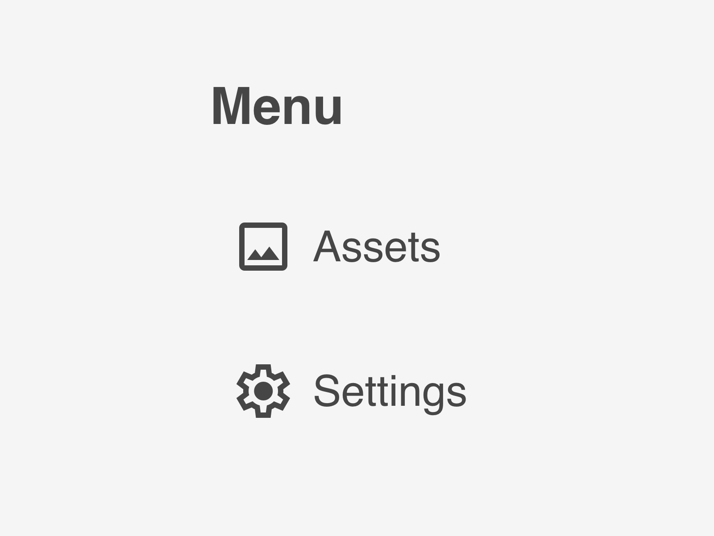

# widget-sidenav

IronFlock widget: A Lit 3.x web component that renders a vertical side navigation menu with Material Design icons. Supports route-based highlighting and emits navigation events for integration with SPA routers.



## Installation

```bash
npm i @record-evolution/widget-sidenav
```

**Peer Dependencies:** This widget requires `@material/web` to be available at runtime via import map or bundled separately.

## Usage

```html
<script type="module">
    import '@record-evolution/widget-sidenav'
</script>

<widget-sidenav-1.0.12></widget-sidenav-1.0.12>
```

> **Note:** The element tag includes the version number (e.g., `widget-sidenav-1.0.12`). This is replaced at build time via `@rollup/plugin-replace`.

## Configuration

The widget accepts an `inputData` property with the following structure:

```typescript
interface InputData {
    title?: string
    route?: string // Navigation route for title click
    leadingSlash?: boolean // Add leading slash to routes
    trailingSlash?: boolean // Add trailing slash to routes
    style?: {
        fontSize?: number
        fontWeight?: number
        color?: string // Font color
        backgroundColor?: string
    }
    navItems?: Array<{
        label?: string
        iconName?: string // Material icon name (e.g., "home", "settings")
        route?: string // Navigation route on click
        leadingSlash?: boolean
        trailingSlash?: boolean
    }>
}
```

## Example Configuration

```javascript
element.inputData = {
    title: 'Dashboard',
    route: '/',
    style: {
        fontSize: 16,
        fontWeight: 500
    },
    navItems: [
        { label: 'Home', iconName: 'home', route: '/' },
        { label: 'Analytics', iconName: 'analytics', route: '/analytics' },
        { label: 'Settings', iconName: 'settings', route: '/settings' }
    ]
}
```

## Navigation Events

When a navigation item is clicked, the widget dispatches a `nav-submit` custom event:

```javascript
element.addEventListener('nav-submit', (e) => {
    console.log(e.detail)
    // { path: "/settings" }
})
```

## Route Matching

The widget highlights the active navigation item based on the current route:

```javascript
element.route = '/settings/profile' // Highlights "Settings" nav item
```

- Routes starting with `/` are matched from the beginning (absolute)
- Other routes are matched from the end (relative)

## Material Icons

Icons are rendered using `@material/web` icon component. Use icon names from [Google Material Symbols](https://fonts.google.com/icons):

```javascript
{
    iconName: 'home'
} // Home icon
{
    iconName: 'settings'
} // Settings gear icon
{
    iconName: 'person'
} // User profile icon
```

## Theming

The widget supports theming via CSS custom properties or the `theme` property:

**CSS Custom Properties:**

```css
widget-sidenav-1.0.12 {
    --re-text-color: #333;
    --re-tile-background-color: #fff;
}
```

**Theme Object:**

```javascript
element.theme = {
    theme_name: 'dark',
    theme_object: {
        backgroundColor: '#1a1a1a',
        title: { textStyle: { color: '#fff' } }
    }
}
```

## Development

```bash
npm run start    # Dev server at localhost:8000/demo/
npm run build    # Production build to dist/
npm run types    # Regenerate TypeScript types from schema
npm run release  # Build, bump version, push to git with tag
```

## License

MIT
